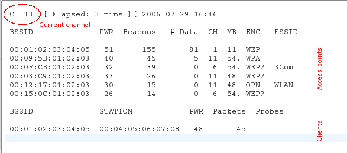

# Install

## Preinstall
Before starting with the install, I would recommend assembling the Hologram NOVA and activating the SIM Card as shown in the very good tutorial of Nova, found [here](https://hologram.io/docs/reference/nova/user-manual/).

## Install Raspbian
Download Raspbian Stretch Lite from [https://www.raspberrypi.org/downloads/raspbian/](https://www.raspberrypi.org/downloads/raspbian/) and burn to an at least 8 GB Class 10 Micro SD Card using [Etcher](https://etcher.io/). Afterwards, create an empty file called ssh in the boot partition of the SD Card, to enable the SSH server. Connect your Raspberry Pi Zero W via an USB Hub and Adaper to a USB Keyboard,  USB network card, Hologram Nova and a HDMI Monitor. Power it up. After boot, change the /etc/dhcpcd.conf and configure a static ip address for your USB network interface to make it more easily accessable.

```
sudo vi /etc/dhcpcd.conf
```

add your static configuration, i.e.

```
interface eth0
static ip_address=192.168.1.2/24
static routers=192.168.1.1
static domain_name_servers=192.168.1.1 8.8.8.8 8.8.4.4

# fallback to static profile on eth0
interface eth0
#fallback static_eth0
```

Save your file and shutdown the RPi. Afterwards you should be able to connect to your RPi via SSH without using the USB Keyboard and Monitor

## Upgrade your Raspbian Installation
```
sudo apt-get update && sudo apt-get dist-upgrade -y
sudo reboot
```

## Install Hologram Nova SDK
```
curl -L hologram.io/python-install | bash
```

If the error ```Cannot find python-sdk-auth``` comes up, just run the command again. You should end up with the output ```You are now ready to use the Hologram Python SDK!```. You can now test it with ```hologram version```, which will output the currently installed version of the Nova SDK (i.e. 0.7.2) - and send a Hello World message using ```sudo hologram send helloWorld```, which should show up in your Nova Dashboard under the "Console". 

## Install the Special Wireless Driver
To enable monitor support of the RPi Zero W Wifi interface, we need to install the special nexmon wireless device driver, which can be found on [https://github.com/seemoo-lab/nexmon](https://github.com/seemoo-lab/nexmon). The complete setup works accordingly to the following [tutorial](https://github.com/seemoo-lab/nexmon#build-patches-for-bcm43430a1-on-the-rpi3zero-w-using-raspbian-stretch-recommended), which should be followed including the final ```apt-get remove wpasupplicant``` step. You should also go to the [Using the Monitor Mode patch](https://github.com/seemoo-lab/nexmon#using-the-monitor-mode-patch-1) section and setup the autoload of the correctly patched driver according to the ```Optional: To make the RPI3 load the modified driver after reboot``` part. After that, you can reboot your RPi Zero W. 

## Load and Test the Monitor Interface
As soon as it comes up again, issue ```sudo iw dev wlan0 info | grep wiphy```. You should get an output like ```wiphy 0```. The 0 is the index of the wiphy interface. With that number, add a monitor interace with the command ```sudo iw phy phy0 interface add mon0 type monitor```, why phy0 needs to be substituted with phy1 if the output of the first step should be wiphy1. Then activate the monitor inteface with ```sudo ifconfig mon0 up```. The mon0 Inteface should now be working. However, we still need a special software called airodump-ng to be able to use it:

## Install airodump-ng and other stuff
Easy as pi(e): ```sudo apt-get install -y aircrack-ng scapy```
If you already started the Monitor Inteface as shown in the previous step, you should now be able to start airodump-ng using ```sudo airodump-ng mon0```. You should now see something similiar to this window:

In the clients section, you will see which devices, i.e. smartphones or laptops are in your area. This is the most important information which we will need to achieve our goal of warning from special devices like Google Glass.
[Picture was taken from aircrack-ng.org Doku](https://www.aircrack-ng.org/doku.php?id=newbie_guide)

### Create a Hologram to Twitter connection
To use Twitter warnings for our system, create a new Account on [Twitter](https://twitter.com/) as well as on [IFTTT](https://ifttt.com). After that, login to your Twitter Account, and link it with IFTTT under the "My Applets, Services, Twitter" section. Create a new Applet. Start with adding a "if" Webhook and call the event name "glassWarning". As "that", add a "Post a tweet" with the text "A problematic device entered the protected area.". Click "create Action". On your Hologram Account, go to the Routes Section, which can be found on [https://dashboard.hologram.io/routes/add](https://dashboard.hologram.io/routes/add) and add a route called "Twitter" with the topic name "twitter", and a "IFTTT Maker Webhook". As EVENT enter "glassWarning", while the WEBHOOK KEY can be found on [https://ifttt.com/services/maker_webhooks/settings](https://ifttt.com/services/maker_webhooks/settings). If is only the cryptic text part of the URL after https://maker.ifttt.com/use/. After that, click "Add route", and your set. You can test the route now with using ```sudo hologram send -t twitter dangerousDeviceName```. If it does not tweet directly on your connected Twitter Account, click on the "Check now" button of your Applet in IFTTT.

## Add a script to monitor and alert if certain devices enter the area
This script was inspired by an old tutorial of SANS from 2011, on how to sniff wifi clients with scapy, an Python Library. You can find the original article [here](https://pen-testing.sans.org/blog/2011/10/13/special-request-wireless-client-sniffing-with-scapy). I just added a part to scan for ```F8:8F:CA:24```, which is the start of the MAC address of Google Glass devices. You could, however, add a bunch of MAC addresses here, or other devices you want to check, i.e. if another tracked device is closing in on your location. As soon as that MAC address is seen, a message is sent to Hologram, which invokes a Twitter message over IFTTT. And thats it :)!

## How to install the script?
```
git clone https://github.com/nmaas87/GlassAware.git
cd GlassAware
chmod +x start.sh
```

To start the script, just enter following command:
```
cd ~/GlassAware
./start.sh
```

And it should be running :)!
If it does not directly tweet, it is because IFTTT does sometimes take up to one hour to check the Webhook. If this is a urgent problem, you can also integrate with Python libraries like tweepy to directly tweet from your device - which would then need to use a direct webconnection and eat more bandwidth from Nova, which it did not want to do here, but try the IFTTT integration and Hologram routing :).
[Twitter Account](https://twitter.com/GlassAware)

## Where to go from here?
Whereever you want - you could add the MAC of your own mobile and let your Pi switch on the lights as soon as you're near the house and add a automatic init script. Happy hacking!
